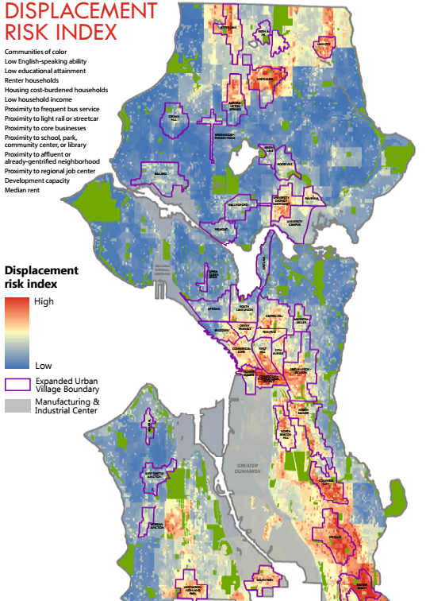
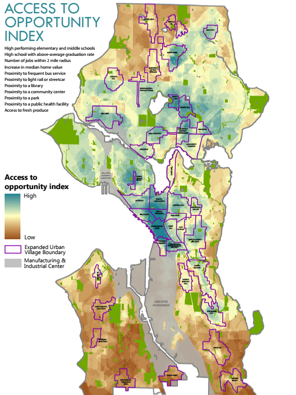

<!-- Packages -->

# Summary {#index}

Predictive variables for gentrification and displacement are examined to answer questions: 

(1) Will improvements to a neighborhood – through green infrastructure or creating a public open space – cause the area to gentrify and displace current residents?

> It depends on how to define gentrification. In general, gentrication caused by neighborhood change leads to involuntary displacement of residents. Thus, it is important to know what factors change neighborhood condition. In addition, what kind of infrastructure would be installed, is also another factor to the degree of neighborhood change. It has been known that having green infrastruture positively affects living quality of the neighborhood, thus increases the value of real estate aroud. 

> To answer the question, it needs to be identified which neighborhood the green infrastructure would be located in. For example, based on the caterogies described in "The uprooted project", if the infrastructure is located in early type 1 tracts, where mostly low income households are with high increase of appreciation of housing market, housing the infrastructure in the tract would expedite the appreciation. On the other hand, if the infrastructure is located in early type 2 tracts, where demographic change is going on with low increase of appreciation, having the infrastructure would be a seed to housing market change. 

(2) What causes areas to gentrify? Is it just a regional real estate function? Or its improvements like upzoning, bringing in light rail etc.?

> In gerneral, investment regarding economic activities such as housing market, business, infrastructure, etc. leads to demographic and built environmental changes, which are the factors for gentrification, displacement and exclusion. Mostly accepted factors to gentrification, however, seem to be income and education. And eviction could be another factor significant to gentrification. For example a study performed comparison of different models as there are many models to identify relevant variables to gentrification. While those variables are different depending on models, however, there was one area where the models agreed: all had a disproportionately greater share of evictions in at-risk areas than total households in these areas. Only two variables — income and education — were included in all four methods. Details are below. 

## Definition of gentrification 

- Neighborhood change - Broad term used to capture the full spectrum of economic, racial or ethnic, and structural changes in a geographic area, both positive and negative. Neighborhood revitalization is a related term that implies change viewed as positive, usually accompanied by new public or private investment.

- Gentrification - Transformation of areas historically inhabited by marginalized groups, usually racial or ethnic or class groups, into areas used by the dominant class or racial or ethnic group. Usually characterized by increased investments in areas that have seen long-term disinvestment.

- Displacement - Forced or involuntary household movement from place of residence. Usually expanded beyond formal forced moves such as evictions to include unaffordable rents or poor living conditions. Displacement is distinct from residential mobility, which includes voluntary household movement.

## Gentrification indicators (causes)

There are the historically indications of displacement, such as transportation investment, percent of rent-burdened households, and availability of affordable housing. Those are devided into two categories: (1) demographic variables, and (2) phisycal variables. 

Gentrification patterns may vary based on the definition, spatial unit, and variables used to identify gentrification. Combining demographic and physical factors drawing on both the physical and sociodemographic variables and combining qualitative and quantitative methods to produce a more holistic consideration of complex socio-spatial phenomena (i.e., gentrification) would be helpful.

### Demographic variables

* Vulnerability - race, renters, education, income, children in poverty 
* Demographic change - income, proportion of white, education, homeownership

### Physical variables 

* Housing markets - housing type, home value, sales, rents, vacant, blighted, public and subsidized, evictions 
* Economic status - business activities, building and demolition permits, capital investments
* Neighborhood condition - transit use, crime, safety 
* Housing market change - accelerating (low present home value, high recent appreciation since 2000), appreciated (previous low home value, high present home value, high appreciation since 1990), and adjacent (low home value touching a track with high present home value or high appreciation since 2000)

## Categorizing 

Different data inputs create different analysis outputs. For example, a study about Seattle identified 10,000 census tracts in 100 large cities that had incomes below the area median in 2000 — these tracts were deemed “gentrifiable.” These tracts experienced the biggest increase in the percentage of college-educated residents by the 2010-2014 period. The tracts that were in the top 10% for this increase were identified as gentrifying. 

On the otherhand, a study about Indianapolis identified gentrifying tracts: 

- Low income with significant growth in home values and education, not gentrifying tracts 
- Low income with no growth, and not eligible tracts 
- Mid-upper income tracts

  

Furthermore, a study about Seattle used opportunity index, which identifies the level of economic opportunity in each neighborhood based on public data on education, access to jobs, transit availability, presence of civic infrastructure, and proximity to health facilities and healthy food. Combining displacement and opportunity ratings, Seattle categorized neighborhoods in four strata: high displacement risk/low access to opportunity, high displacement risk/high access to opportunity, low displacement risk/low access to opportunity, and low displacement risk/high access to opportunity.

In general, based on the income level and changes of demographic and physical variables, gentrification could be identified with a level of being at risk and ongoing gentrification. 

* Low income - no change, at risk (having development factors), ongoing gentrification(loss of low income households)

* Moderate and high income - advanced gentrification, no change, at risk, ongoing, advanced exclusion (low income migration rate) 

A study specifying the above devided the patterns into six categories: susceptible, early type 1, type 2, dynamic, late and Continued Loss tracts ( non-vulnerable tracts) based on demographic change, real estate value, and appreciation. 

Susceptible tracts have not experienced demographic change, and are in areas adjacent to ones showing signs of housing market appreciation. Early: Type 1 tracts have not yet experienced demographic change but are experiencing an accelerating market. Early: Type 2 tracts are the other way around: they have experienced demographic change but are not yet accelerating and instead are next to an accelerating or appreciating tract. Dynamic tracts have experienced demographic change and are experiencing accelerating market conditions, whereas Late tracts have also experienced demographic change but are in an appreciated housing market state. Finally, among non-vulnerable tracts, Continued Loss tracts, in addition to having recently experienced an increase in their white and college educated populations, are in an appreciated market condition.

### Challenges 

There is a study comparing four methods to map gentrification. They showed differnt analysis outputs. However, there was one area where the models agreed: all had a disproportionately greater share of evictions in at-risk areas than total households in these areas. Only two variables — income and education — were included in all four methods.

## Presentation of gentrification

It is necessary to map gentrification area and areas with risks to prevent displacement. The i-team from CA used gentrification indices to assist with site selection for its Rent Stabilization Ordinance (RSO) outreach campaign, a marketing and awareness initiative to help tenants and landlords better understand and access city resources that can help longtime residents stay in their homes during periods of rising prices.

Mapping gentrification could be helpful in terms of the current status quo and predictive manner. 

* Gentrification map - For example, Los Angeles Index of Neighborhood Change, a map that allows users to explore the degree to which zip codes in Los Angeles experienced gentrification between 2000 and 2014. 

* Risk (prediction) map - Los Angeles Index of Displacement Pressure, which repurposed much of the data from the neighborhood change project in addition to information from ESRI Community Analyst in order to predict neighborhoods where displacement was likely to occur.

Infrasturcture is also playing a significant role for gentrification. A study mapped neighborhood change and gentrification in the purple line corridor (http://knaaptime.com/plcc-dashboard/gentrification.html).

* Blue: High income tracts

* Green: Gentrification - light, medium and dark based on income increase - defined as an increase in home prices, and the population’s education level, that was greater than the increases that occurred in the region as a whole. This map uses this methodology, but breaks down the areas that pass the gentrification test into three categories. 

* Red: Risk of gentrification - not yet gentrification, but likely to happen - these areas are at risk for accelerated increases in home prices and an influx of educated residents because they have seen, relative to other areas: greater increases in population, the proportion of the population that is white, median household income, education levels, home values, the number of housing units, rent prices, the homeownership rate, and decreases in the poverty rate. Areas that have good accessibility to jobs, both by automobile and transit, are at a higher risk to gentrify, as are areas that are within one mile of a rail-transit station, including new Purple Line stations.

### Mapping 

A study found mapping based on parcel level rather than tracts is preferred. Furthermore, density mapping such as kernel density version of the tax parcel maps were found to be preferred.

# Reference 

https://sites.utexas.edu/gentrificationproject/gentrification-mapping-methodology/

https://www.urban.org/sites/default/files/publication/100135/guide_to_measuring_neighborhood_change_to_understand_and_prevent_displacement.pdf

https://www.govtech.com/data/Using-Mapping-to-Understand-Gentrification-Prevent-Displacement.html

https://datasmart.ash.harvard.edu/news/article/where-is-gentrification-happening-in-your-city-1055

https://www.urbandisplacement.org/map/sf

https://medium.com/sidewalk-talk/the-challenges-of-mapping-gentrification-851c13df5b9e

https://www.gislounge.com/using-gis-study-gentrification/

https://www.governing.com/gov-data/indianapolis-gentrification-maps-demographic-data.html

https://projects.oregonlive.com/maps/gentrification/

https://www.portland.gov/bps/adap/gentrification-and-displacement-studies

https://gisdata.fultoncountyga.gov/datasets/c36bb3b8c0744aa7a04a52031473790a

https://academicworks.cuny.edu/cgi/viewcontent.cgi?article=3302&context=gc_etds

http://knaaptime.com/plcc-dashboard/gentrification.html

https://www.tandfonline.com/doi/abs/10.1080/23754931.2020.1789499?journalCode=rpag20 

https://www.urbanstudiesonline.com/resources/resource/mapping-gentrification-and-displacement-pressure-an-exploration-of-four-distinct-methodologies/ 

https://www.seattletimes.com/seattle-news/data/seattle-ranks-near-top-for-gentrification-but-that-might-not-be-as-bad-as-you-think-study-finds/

https://www.urbandisplacement.org/map/austin

https://www.urbandisplacement.org/sites/default/files/images/udpaustin_methodology.pdf

https://www.housingstudies.org/blog/mapping-neighborhood-change/

 