# Summary {#index}

Predictive variables for gentrification and displacement are examined to answer questions: 

(1) Will improvements to a neighborhood – through green infrastructure or creating a public open space – cause the area to gentrify and displace current residents?

It depends on how to define gentrification. Gentrification is a process and defined differently using various indicators. For example, Seattle defines gentrification with low income and education increase while Indianapolis defines it with low income and growth in home value and education. Furthermore, eviction could be considered as a symptom, the result of gentrification, but also it could be an indicator to define gentrification in that indicators and causes are different. In general, gentrification caused by neighborhood change leads to involuntary displacement of residents. Thus, it is important to know what factors change neighborhood condition. In addition, what kind of infrastructure would be installed, is also another factor to the degree of neighborhood change. Having green infrastructure positively affects living quality of the neighborhood, thus increases the value of real estate around. 

To answer the question, which neighborhood the green infrastructure would be located in should be identified. For example, based on the categories described in "The uprooted project", if the infrastructure is located in early type 1 tracts, where mostly low income households are with high increase of appreciation of housing market, housing the infrastructure in the tract would expedite the appreciation. On the other hand, if the infrastructure is located in early type 2 tracts, where demographic change is going on with low increase of appreciation, having the infrastructure would be a seed to housing market change. 

(2) What causes areas to gentrify? Is it just a regional real estate function? Or its improvements like upzoning, bringing in light rail etc.?

In general, investment regarding economic activities such as housing market, business, infrastructure, etc. leads to demographic and built environmental changes, which would cause gentrification, displacement and exclusion.

Suggested causes for gentrification - for the tracts with higher vulnerability (with respect to renters, education, income, and race), infrastructure investment or development will lead to demographic changes, and neighborhood condition, housing market, and economic changes. Capital investment on projects such as expanding urban village, developing business center for technology companies, establishing state public educational institutes, etc. will change the built environment and cause demographic change due to the job creation. This phenomenon will increase property value of housings adjacent to the development and finally property tax will increase. The state property tax in turn goes back to the City of Seattle for the further projects according to the capital improvement plan (CIP).

Four indicators are suggested with respect to the argument above:

* Vulnerable community index (race, renters, education, income)
* Urban village development (upzoning) index
* Proximity to jobs and nature (university, companies, waterfront, etc.)
* Higher housing value

(3) How much has green infrastructure been REPORTED to increase a property’s value?

Many studies have found green infrastructure has positive impacts on property values.

* "transferring water resource to public ownership will increase a property’s sale price by 0.0353% for a wetland and 0.1177% for a stream" (Netusil, 2013); 

* "properties on tree-lined streets are valued at up to 30% more than those on streets without trees" ("Benefits of Green Infrastructure”); 

* "realtor based estimates of street tree versus non street tree comparable streets relate a $15-25,000 increase in home or business value" (Burden, 2006); 

* 25% of survey participants see increasing property values (Mell et al., 2013); 

* "marginal benefits to one household of preserving neighboring open space range from \$994 to \$3,307 per acre of farmland that is preserved, depending on whether it is publicly or privately owned" (Irwin, 2002); 

* "the effect of neighborhood association-owned forest and water feature was approximately 8% at the mean sale price with a value of \$14488 for association-owned forests, and \$14681 for a water feature" (Bowman et al., 2012); and 

* "increase in home price is approximately \$18 for every acre of public park within walking distance" (Bowman et al., 2012). 

Specially bioswales are also known to improve local property values (Anderson, 2018). O'Neill (2013) mentioned that "the neighborhoods will see an increase in property values and habitability due both the functional and aesthetic value of the bioswales." Furthermore, Ward et al., (2008) argued that the property value of the green grid in north Seattle (on street bioswales) increases about 3.5 to 5 percent.

In addition, Gurdon and Jakuba (2018) shows two cases which prove increase of property values around wastewater treatment facilities.

(4) What factors contribute to increased property values?

CIP and private venture capital investments seem to increase property values by developing local infrastructure serving citizens. In addition, proximity to jobs and nature could be also increasing property values. Jobs are normally created by capital investments and accommodating companies. Increased property value causes higher property tax, which becomes the revenue to CIPs.

Housing market trend would be the one relevant to our research in gentrification. And housing market trends seem to follow venture capital investment. In this regard, venture capital could be a cause of gentrification on tracts with higher vulnerability.

It seems properties around Green lake, Roosevelt reservoir, waterfront view, etc. are higher on the premise of the fact that they are close to downtown where most of the business activities are happening. So It can be clearly assumed that the proper indicators for gentrification are the combination of the close distance to the business or commercial center and natural benefits such as park, waterfront view, etc. Additionally, there is higher demand for student housing around campus, the housing values around campus(e.g., UW has over 40,000 students) also seem higher from the perspective of source of income from renting.

# Displacement

## Definition of gentrification 

Gentrification is a process and defined differently using various indicators. For example, Seattle defines gentrification with low income and education increase while Indianapolis defines it with low income and growth in home value and education. Furthermore, eviction could be considered as a symptom, the result of gentrification, but also it could be an indicator to define gentrification in that indicators and causes are different. 

Suggested causes for gentrification - for the tracts with vulnerability (renters, education, income, and race), infrastructure investment or development will lead to demographic changes, neighborhood condition, housing market, and economic changes. 

- Neighborhood change - "Broad term used to capture the full spectrum of economic, racial or ethnic, and structural changes in a geographic area, both positive and negative. Neighborhood revitalization is a related term that implies change viewed as positive, usually accompanied by new public or private investment" (Cohen and Pettit, 2019).

- Gentrification - "Transformation of areas historically inhabited by marginalized groups, usually racial or ethnic or class groups, into areas used by the dominant class or racial or ethnic group. Usually characterized by increased investments in areas that have seen long-term disinvestment" (Cohen and Pettit, 2019).

- Displacement - "Forced or involuntary household movement from place of residence. Usually expanded beyond formal forced moves such as evictions to include unaffordable rents or poor living conditions. Displacement is distinct from residential mobility, which includes voluntary household movement" (Cohen and Pettit, 2019).

## Gentrification indicators (causes)

There are the historical indications of displacement, such as "transportation investment, percent of rent-burdened households, and availability of affordable housing" (Bousquet, 2017). Those are divided into two categories: (1) demographic variables, and (2) physical variables. 

Yonto and Schuch (2020) mentioned that "gentrification patterns may vary based on the definition, spatial unit, and variables used to identify gentrification. Combining demographic and physical factors drawing on both the physical and sociodemographic variables and combining qualitative and quantitative methods to produce a more holistic consideration of complex socio-spatial phenomena (i.e., gentrification) would be helpful."

### Demographic variables

* Vulnerability - race, renters, education, income, children in poverty 
* Demographic change - income, proportion of white, education, home ownership

### Physical variables 

* Housing markets - housing type, home value, sales, rents, vacant, blighted, public and subsidized, evictions 
* Economic status - business activities, building and demolition permits, capital investments
* Neighborhood condition - transit use, crime, safety 
* Housing market change - accelerating (low present home value, high recent appreciation since 2000), appreciated (previous low home value, high present home value, high appreciation since 1990), and adjacent (low home value touching a track with high present home value or high appreciation since 2000) (“Gentrification Mapping Methodology," 2020)

## Various presentation of gentrification

Different data inputs create different analysis outputs. For example, a study about Seattle identified "10,000 census tracts in 100 large cities that had incomes below the area median in 2000 — these tracts were deemed “gentrifiable.” These tracts experienced the biggest increase in the percentage of college-educated residents by the 2010-2014 period. The tracts that were in the top 10% for this increase were identified as gentrifying." (“Seattle is the third," 2019). 

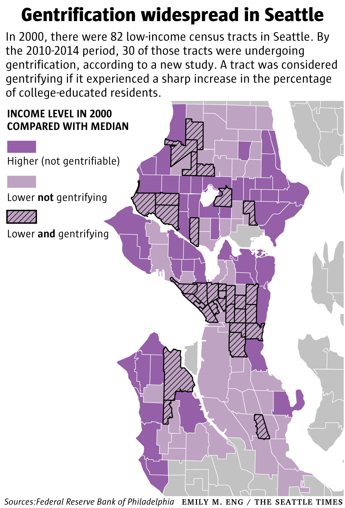

On the other hand, a study about Indianapolis identified gentrifying tracts: 

- Low income with significant growth in home values and education, not gentrifying tracts 
- Low income with no growth, and not eligible tracts 
- Mid-upper income tracts

  

Puget Sound Regional Council developed displacement risk mapping based on the five categories: socio-demographics, transportation qualities, neighborhood characteristics, housing, and civic engagement. 
  
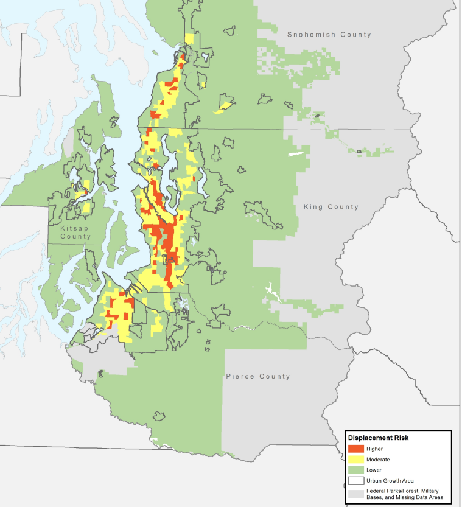  

## Gentrification in Seattle

Furthermore, a study about Seattle used opportunity index, "which identifies the level of economic opportunity in each neighborhood based on public data on education, access to jobs, transit availability, presence of civic infrastructure, and proximity to health facilities and healthy food. Combining displacement and opportunity ratings, Seattle categorized neighborhoods in four strata: high displacement risk/low access to opportunity, high displacement risk/high access to opportunity, low displacement risk/low access to opportunity, and low displacement risk/high access to opportunity." (“Where is Gentrification Happening,” 2017).

### Displacement index

- Communities of color
- Low English-speaking ability
- Low educational attainment
- Renter households
- Housing cost-burdened households
- Low household income
- Proximity to frequent bus service
- Proximity to light rail or streetcar
- Proximity to core businesses
- Proximity to school, park, community center, or library
- Proximity to affluent or already-gentrified neighborhood
- Proximity to regional job center
- Development capacity
- Median rent

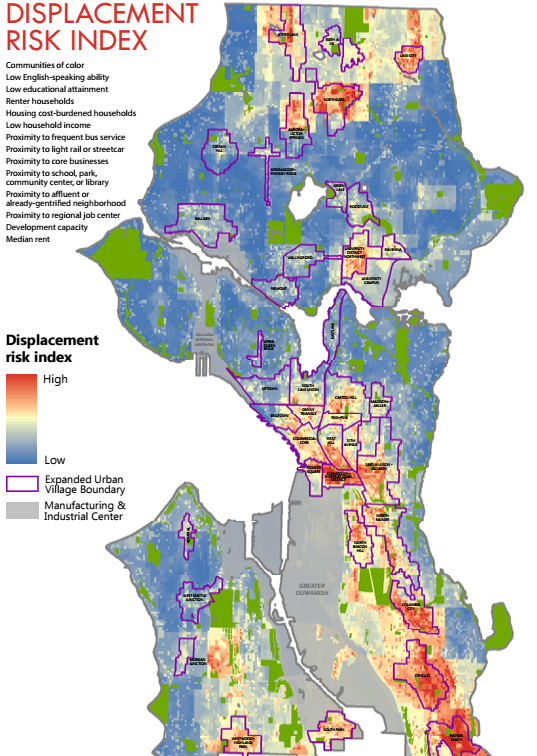

### Opportunity index

- High performing elementary and middle schools
- High school with above-average graduation rate
- Number of jobs within 2 mile radius
- Increase in median home value
- Proximity to frequent bus service
- Proximity to light rail or streetcar
- Proximity to a library
- Proximity to a community center
- Proximity to a park
- Proximity to a public health facility
- Access to fresh produce

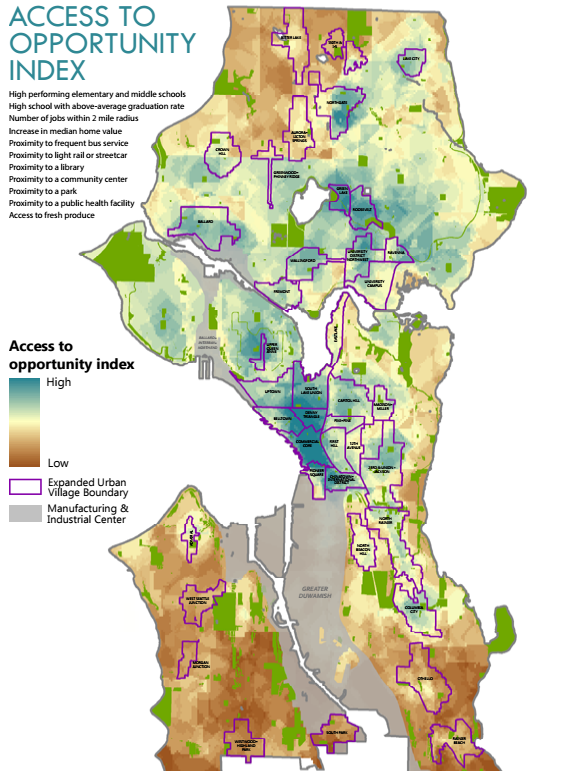

Definitely, the two indexes share elements because the indexes are not mutually exclusive nor collectively exhaustive. I think this is common because a place with opportunities would be wanted by all so that this would incur displacement of some population. In the meantime, Displacement index focuses more on vulnerability while Opportunity index does on expected advantages. 

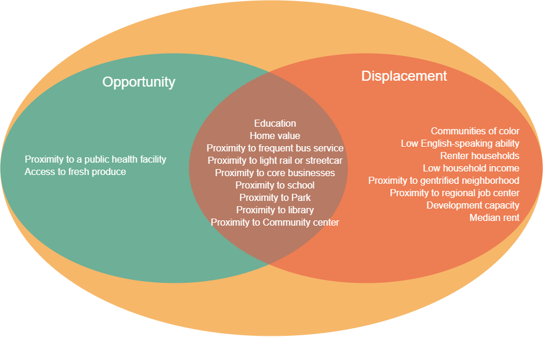

Seattle categorized neighborhoods in four strata: high displacement risk/low access to opportunity, high displacement risk/high access to opportunity, low displacement risk/low access to opportunity, and low displacement risk/high access to opportunity.” (“Where is Gentrification Happening,” 2017).

Furthermore, there are places with lower Displacement and Opportunity indexes such as West Seattle Junction, and Morgan Junction as indicated below figure. So I think the two indexes are still useful to analyze gentrification with identification of places in Seattle. 

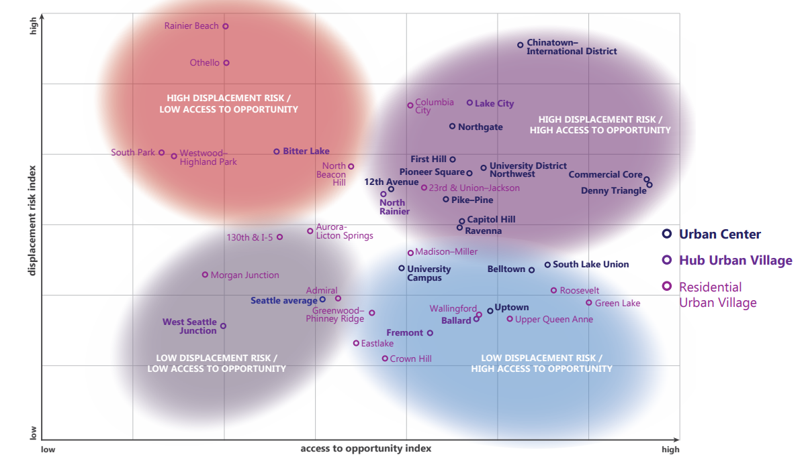

## Categorizing 

In general, based on the income level and changes of demographic and physical variables, gentrification could be identified with a level of being at risk and ongoing gentrification. 

* Low income - no change, at risk (having development factors), ongoing gentrification(loss of low income households)

* Moderate and high income - advanced gentrification, no change, at risk, ongoing, advanced exclusion (low income migration rate) 

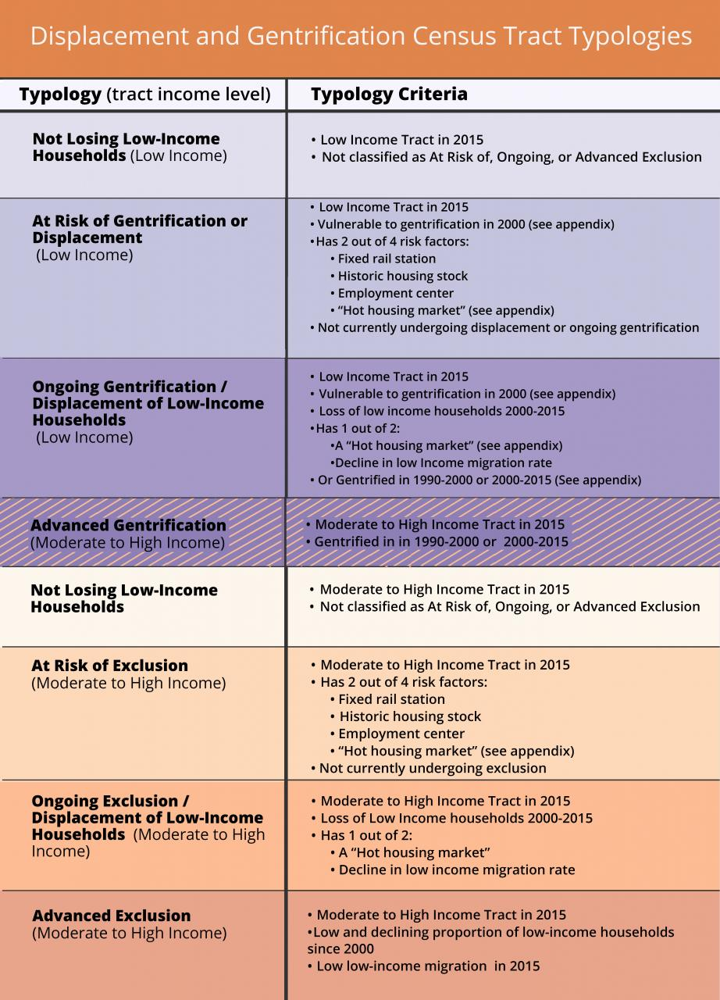

A study specifying the above divided the patterns into six categories: susceptible, early type 1, type 2, dynamic, late and Continued Loss tracts ( non-vulnerable tracts) based on demographic change, real estate value, and appreciation. 

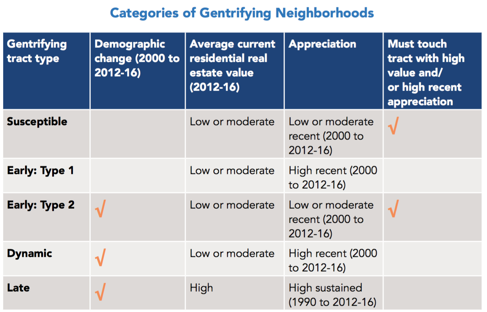

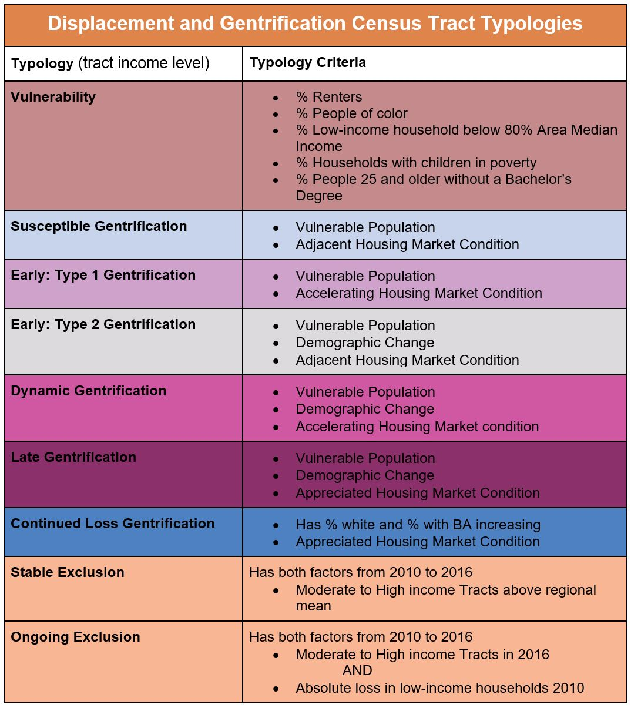

“Gentrification Mapping Methodology” (2020) mentioned, "Susceptible tracts have not experienced demographic change, and are in areas adjacent to ones showing signs of housing market appreciation. Early: Type 1 tracts have not yet experienced demographic change but are experiencing an accelerating market. Early: Type 2 tracts are the other way around: they have experienced demographic change but are not yet accelerating and instead are next to an accelerating or appreciating tract. Dynamic tracts have experienced demographic change and are experiencing accelerating market conditions, whereas Late tracts have also experienced demographic change but are in an appreciated housing market state. Finally, among non-vulnerable tracts, Continued Loss tracts, in addition to having recently experienced an increase in their white and college educated populations, are in an appreciated market condition."

## Challenges 

There is a study comparing four methods of mapping gentrification. They showed different analysis outputs that the result would be different depending upon which method used. However, there was one variable which the models agreed that all at-risk area had a greater share of evictions. Furthermore, only two variables (i.e., income and education) were shared in all four methods. 

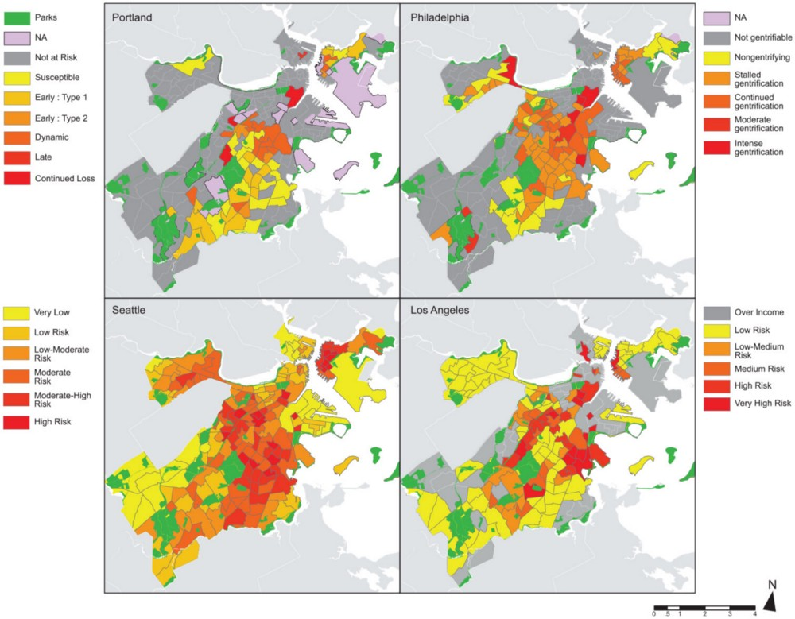

## Suggested indicators

The main indicator for gentrification is public and private investment because it leads to built environment change followed by demographic change. Capital investment on projects such as expanding urban village, developing business center for tech. companies, establishing state public educational institutes, etc. will change the built environment and cause demographic change due to the job creation. This phenomenon will increase property value of housings adjacent to the development and finally property tax will increase. The state property tax in turn goes back to the City of Seattle for the further projects according to the capital improvement plan (CIP). 

Four indicators are suggested with respect to the argument above: 

- Vulnerable community index (race, renters, education, income) 
- Urban village development (upzoning) index 
- Proximity to jobs and nature (university, companies, waterfront, etc.) 
- Higher housing value

There are other indicators such as distance to mess transportation, hospital, etc. But currently it is assumed to be less significant compared to the suggested four indicators. If time allows, regression models could be performed to test the significance of the indicators to explain gentrification and displacement. 

## Presentation of gentrification

It is necessary to map gentrification area and areas with risks to prevent displacement. The i-team from CA used "gentrification indices to assist with site selection for its Rent Stabilization Ordinance (RSO) outreach campaign, a marketing and awareness initiative to help tenants and landlords better understand and access city resources that can help longtime residents stay in their homes during periods of rising prices" (“Where is Gentrification Happening,” 2017). 

Mapping gentrification could be helpful in terms of the current status quo and predictive manner. 

* Gentrification map - "Los Angeles Index of Neighborhood Change, a map that allows users to explore the degree to which zip codes in Los Angeles experienced gentrification between 2000 and 2014" (“Where is Gentrification Happening,” 2017). 

* Risk (prediction) map - "Los Angeles Index of Displacement Pressure, which repurposed much of the data from the neighborhood change project in addition to information from ESRI Community Analyst in order to predict neighborhoods where displacement was likely to occur" (“Where is Gentrification Happening,” 2017).

Infrastructure is also playing a significant role in gentrification. A study mapped neighborhood change and gentrification in the purple line corridor.

* Blue: High income tracts

* Green: Gentrification - "light, medium and dark based on income increase - defined as an increase in home prices, and the population’s education level, that was greater than the increases that occurred in the region as a whole. This map uses this methodology, but breaks down the areas that pass the gentrification test into three categories" (“Purple Line Corridor,” 2020). 

* Red: Risk of gentrification - not yet gentrification, but likely to happen - "these areas are at risk for accelerated increases in home prices and an influx of educated residents because they have seen, relative to other areas: greater increases in population, the proportion of the population that is white, median household income, education levels, home values, the number of housing units, rent prices, the home ownership rate, and decreases in the poverty rate. Areas that have good accessibility to jobs, both by automobile and transit, are at a higher risk to gentrify, as are areas that are within one mile of a rail-transit station, including new Purple Line stations" (“Purple Line Corridor,” 2020).

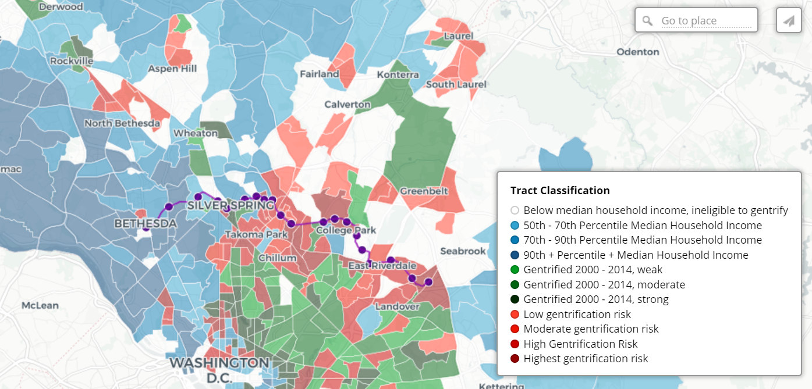

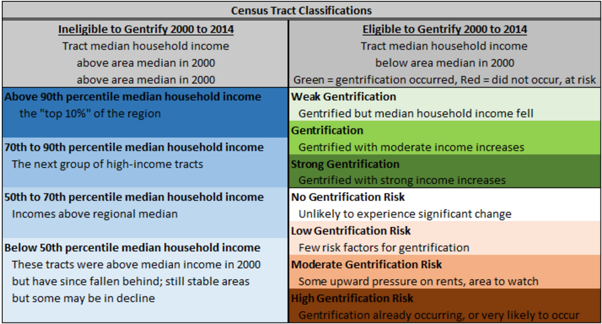

### Mapping 

A study found mapping based on smaller scale such as parcel level rather than tracts is more accurate and preferred. Furthermore, density mapping such as kernel density version of the tax parcel maps were found to be preferred to point and census tract maps. 

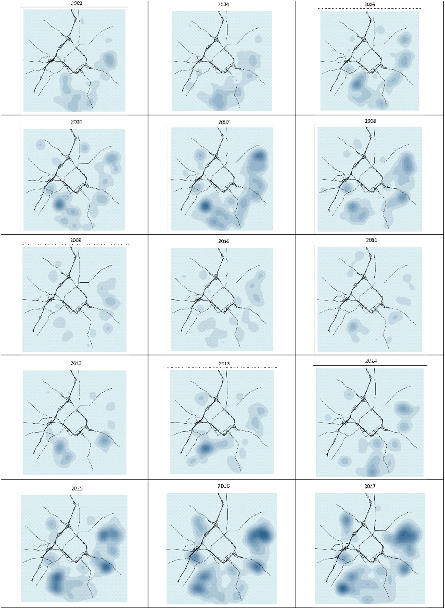

# Property values and property taxes

Appreciation of property - the appraisal process will help us understand what indicators they look at when they value a house. Market trends, similar type of the property in neighbor, and the condition of the house are affecting how values are determined. 

"A property's appraisal value is influenced by recent sales of similar properties and by current market trends. The home's amenities, the number of bedrooms and bathrooms, floor plan functionality, and square footage are also key factors in assessing the home's value. The appraiser must do a complete visual inspection of the interior and exterior and note any conditions that adversely affect the property's value, such as needed repairs" (Fontinelle, 2020). 

"Each year, our accredited appraisers assess your property at its full market value using one or all of three approaches: Market (comparable sales), Cost (reproduction or replacement cost, less depreciation) or Income (income or capitalization of economic rents). They also state that they value homes in Seattle, and across the county, based on 100% of “true and fair” market value. Taxation is the sole purpose of the assessed value. This figure is used to determine the amount of property tax charged for homes in Seattle. In Washington State, property taxes can be used to cover a variety of government expenses, including schools, police and fire services, sewage, infrastructure and more. In some ways, the appraised value (determined by a licensed home appraiser) is similar to the fair market value mentioned earlier. The distinction is that the appraisal is one person’s opinion, while the fair market value can be determined by anyone who evaluates local real estate conditions, such as an agent" ("Market Value 101: How Much," 2016). 

"Seattle, Washington is without doubt one of the hottest real estate markets in the country right now. It has been for a while. High demand and limited inventory have forced home buyers to compete fiercely, especially in the more sought-after areas. As a result of these trends, the median home price in Seattle recently rose to $755,600" ("Seattle 2020 Mortgage," 2020). 

The trend of land value shows that areas near business regions, where big companies and commercial districts are located, have higher land values. 

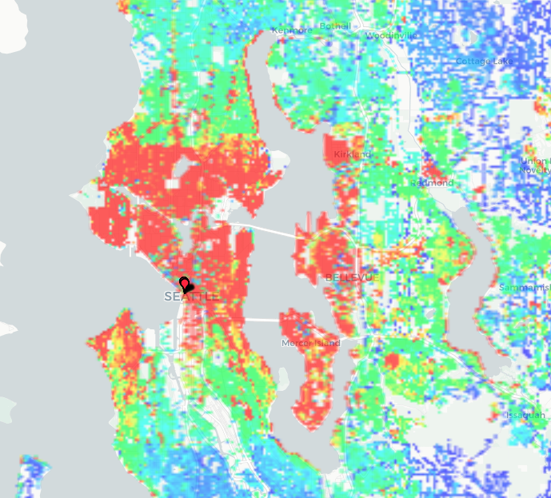

On the other hand, median house value changes since 2000 show distinguishable area with higher increases. The areas with higher house value change are proximity to jobs and nature (university, companies, waterfront, parks, etc.). 

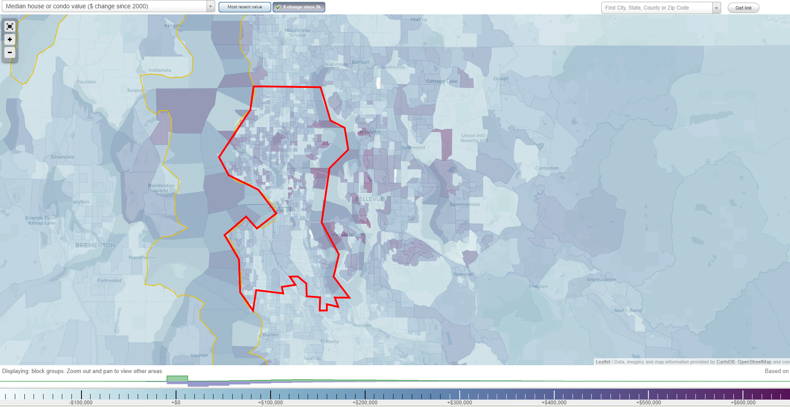

## Factors increasing property values

CIP and private venture capital investments seem to increase property values by developing local infrastructure serving citizens. In addition, proximity to jobs and nature could be also increasing property values. Jobs are normally created by capital investments and accommodating companies. Increased property value causes higher property tax, which becomes the revenue to CIPs. 

### Capital improvement plan

"A capital improvement plan (CIP), or capital improvement program, is a short-range plan, usually four to ten years, which identifies capital projects and equipment purchases, provides a planning schedule and identifies options for financing the plan" ("Capital improvement plan," 2020).

"Like all large municipalities, Seattle relies on a variety of sources to pay for capital projects. These include locally generated revenues (taxes, fees, voter-approved levies, and user fees), intergovernmental revenues (including state and federal grants), private funding (franchise utilities, philanthropy) and debt issuance. These traditional sources continue to provide the majority of funding for capital facility investments. The City’s level of capital investment is based on the mix and amount of
financial resources available to the City" ("2019 - 2024 Capital Improvement Plan Overview," 2019). 

"Funding of the City’s general government capital program is highly dependent on revenue from Real estate exercise tax (REET)" ("2019 - 2024 Capital Improvement Plan Overview," 2019). 

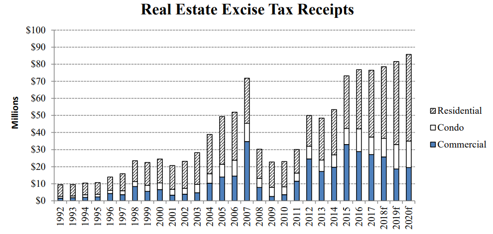

Proposed CIPs by department are mainly electricity and transportation followed by drainage and wastewater, water, park, and recreation projects. 

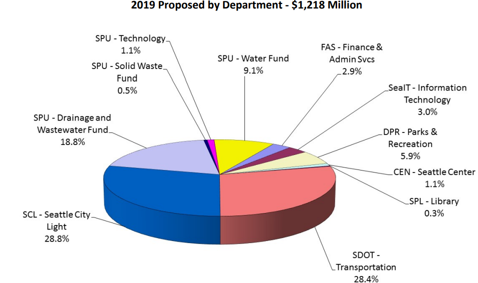

Most of funds come from utility funding. 

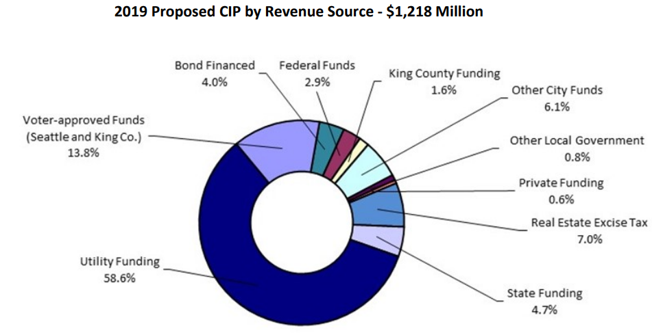

Property tax is also a source of fund for the local CIPs. "The passage of the Park District is the culmination of the Parks Legacy Plan project, led by the Parks Legacy Plan Citizens' Advisory Committee. The goal of the Park District is to provide long term, stable funding to support recreation programming, parks projects and the critical needs for investment in major and ongoing maintenance. In 2016, the Parks District began collecting property tax revenue, accumulating the first year of full funding for Park District projects. The Park District will provide over $29 million in 2019 for major maintenance and capital projects" ("2019 - 2024 Capital Improvement Plan Overview," 2019). 

"The average effective property tax rate in King County is 0.95%. It's also the county with the state's highest median annual property tax payment at \$4,254. In Seattle, the total rate is about \$8.29 per $1,000 in assessed value" ("Washington state property," 2020). 

25% of property taxes in Seattle in 2018 went to the city while serving other purposes. 

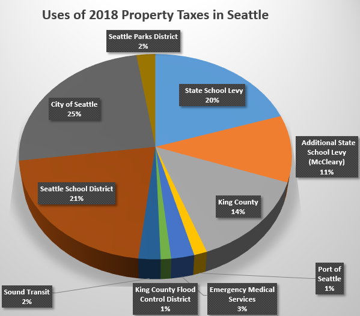

Property tax contributes 24.5 percent to the general subfund in Seattle. 

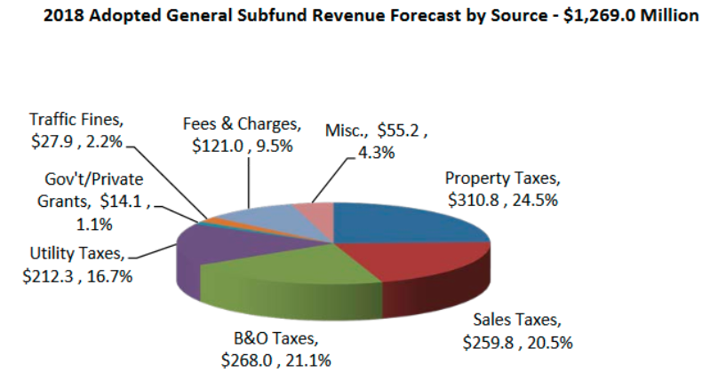

### Venture capital 

Housing market trend would be the one relevant to our research in gentrification. And housing market trends seem to follow venture capital investment. In this regard, venture capital could be a cause of gentrification on tracts with higher vulnerability.

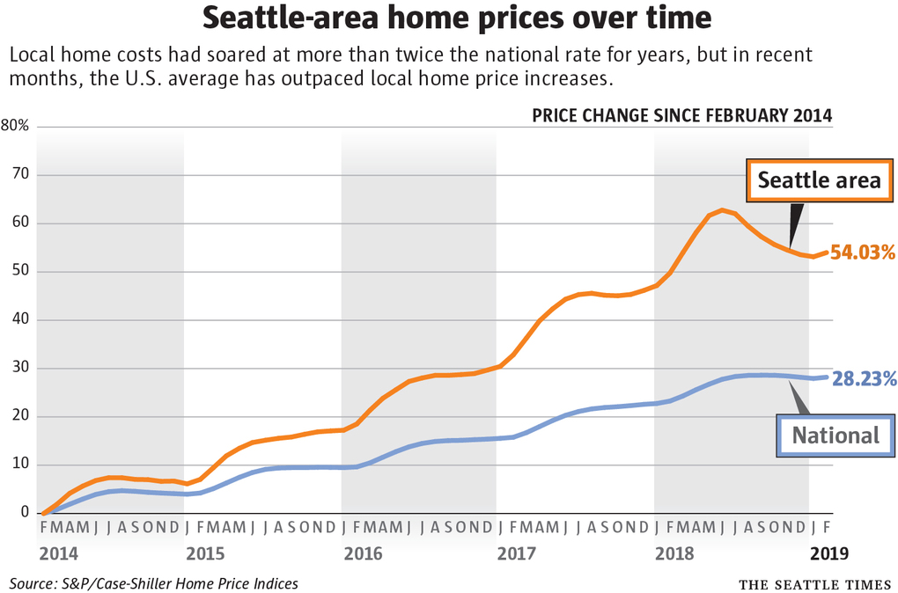

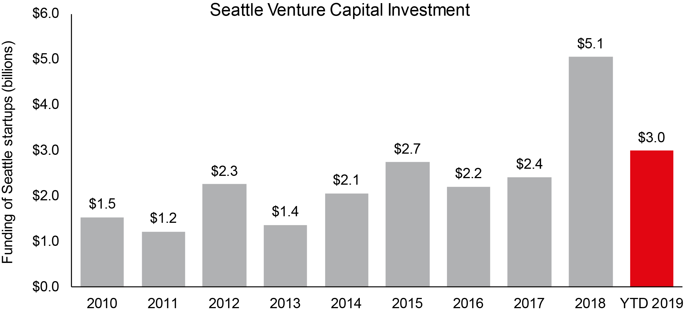

### Proximity to jobs and nature 

It seems properties around Green lake, Roosevelt reservoir, waterfront view, etc. are higher on the premise of the fact that they are close to downtown where most of the business activities are happening. So It can be clearly assumed that the proper indicators for gentrification are the combination of the close distance to the business or commercial center and natural benefits such as park, waterfront view, etc. Additionally, there is higher demand for student housing around campus, the housing values around campus(e.g., UW has over 40,000 students) also seem higher from the perspective of source of income from renting.

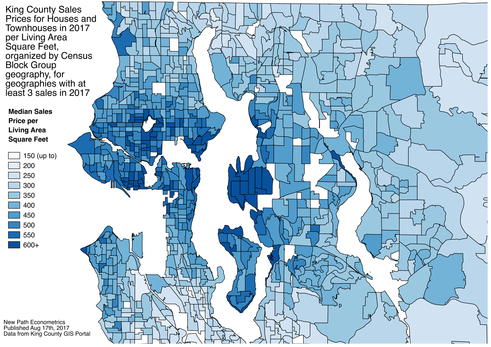

# Impact of green infrastructure on property values

Many studies have found green infrastructure has positive impacts on property values: 

(1) "transferring water resource to public ownership will increase a property’s sale price by 0.0353% for a wetland and 0.1177% for a stream" (Netusil, 2013); 

(2) "properties on tree-lined streets are valued at up to 30% more than those on streets without trees" ("Benefits of Green Infrastructure”); 

(3) "realtor based estimates of street tree versus non street tree comparable streets relate a $15-25,000 increase in home or business value" (Burden, 2006); 

(4) 25% of survey participants see increasing property values (Mell et al., 2013); 

(5) "marginal benefits to one household of preserving neighboring open space range from \$994 to \$3,307 per acre of farmland that is preserved, depending on whether it is publicly or privately owned" (Irwin, 2002); 

(6) "the effect of neighborhood association-owned forest and water feature was approximately 8% at the mean sale price with a value of \$14488 for association-owned forests, and \$14681 for a water feature" (Bowman et al., 2012); and 

(7) "increase in home price is approximately \$18 for every acre of public park within walking distance" (Bowman et al., 2012). 

"NDSs also generate broad public appeal and may even increase the property value of retrofitted neighborhoods" ("Incorporating Water Quality Features," 2020). 

Netusil (2013) mentioned, "Using the spatial lag model coefficients...transferring 1000 square feet of a privately owned water resource to public ownership will increase a property's sale price by 0.0353% for a wetland and 0.1177% for a stream. These values can be used to calculate a lower-bound benefit estimate for an acquisition by creating a ¼ mile buffer around single-family residential properties and determining, for a specific site, how many of those buffers overlap the water resource."

"Street trees and green infrastructure enhance aesthetic qualities and provide a significant neighborhood amenity. Properties on tree-lined streets are valued at up to 30% more than those on streets without trees" ("Benefits of Green Infrastructure”). 

"Realtor based estimates of street tree versus non street tree comparable streets relate a $15-25,000 increase in home or business value. This often adds to the base tax base and operations budgets of a city allowing for added street maintenance. Future economic analysis may determine that this is a break-even for city maintenance budgets" (Burden, 2006).

Below is how people see the impact of green infrastructure on property value increase for investment.

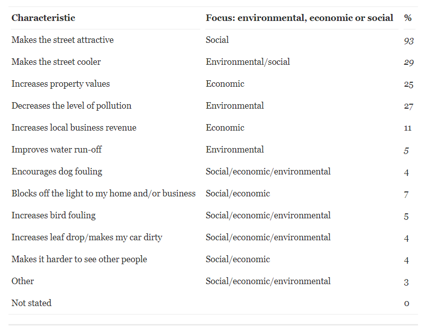

"Tyra¨vinen and Miettinen (2000) conduct a careful study of the spillover effects of the various attributes associated with urban forests on housing prices in a semi-rural area in Finland. They find that the distance to the nearest small area of forest has a negative and significant effect, and that the presence of a forest view from the housing unit has a positive influence...Given the conditions within the Maryland study area, which are characterized by relatively high rates of population growth and land conversion, we find that the marginal benefits to one household of preserving neighboring open space range from \$994 to \$3,307 per acre of farmland that is preserved, depending on whether it is publicly or privately owned" (Irwin, 2002).

"Consequently the neighborhoods in which they are built will see an increase in property values and habitability due both the functional and aesthetic value of the bioswales" (O’Neill, 2013). 

Anderson (2018) mentioned, "Additional benefits of bioswales include growth of vegetation, which has been shown to improve asphalt longevity (McPherson, 2005), mitigate the urban heat island effect, and improve local property values (Bowman, 2010)."

Bowman et al. (2012) shows many examples for valuation of conservation design and low-impact development in residential area as below. 

* "Public parks and nearby open space have been shown to positively influence housing prices by both proximity and amount of use (Bolitzer and Netusil, 2000, Bowman et al., 2009; Kitchen and Hendon, 1967; Lutzenhiser and Netusil, 2001)."

* "The effects of neighborhood association-owned forest and water features were positive and significant. The marginal effect of these features was approximately 8% at the mean sale price with a value of \$14488 for association-owned forests, and \$14681 for a water feature. These findings are similar to other studies (e.g., Lorenzo et al., 2000, Ready and Abdalla, 2005) with the presence of private forests associated with higher home prices."

* "However, for publically-held open space size did matter -open space within walking distance (500 m) of a house had a marginal effect (at p < 0.057) of 0.02% per acre, which at the mean price of a home in Ames is an increase in home price of approximately $18 for every acre of public park within walking distance. As Peiser and Schwann (1993) found, this effect is miniscule when compared with the marginal effect of a similar amount of additional lot space (\$24659 at the mean sale price)...previous hedonic price model studies identify the value of public open space and the significant positive effect they have on home prices within a community (Bolitzer and Netusil, 2000, Correll et al., 1978)."

* "Finally, a spatial hedonic price model using 2093 homes in Ames, IA was used to estimate the effect of public and private open space on housing values. The model indicated that presence of neighborhood association-owned forest and water features as well as proximity to public parks had significant positive effects on housing prices. However, proximity to a public lake had a negative effect on home values."

## Bioswales 

Specially bioswales are also known to improve local property values (Anderson, J., 2018). O'Neill (2013) mentioned that "the neighborhoods will see an increase in property values and habitability due both the functional and aesthetic value of the bioswales." Furthermore, Ward et al., (2008) argued that the property value of the green grid in north Seattle (on street bioswales) increases about 3.5 to 5 percent.

"A preliminary analysis of the effect of LID on property values in Seattle indicates that the introduction of LIDs increased property values by 3.5 – 5 percent. Compared to similar houses (e.g., in terms of square feet of living space, building quality, lot size, etc.) in the same zip-code, houses in Seattle’s Street Edge Alternative (SEA), Broadview Green Grid, Pinehurst Green Grid, and High Point projects sold for 3.5 – 5 percent more during the period after the adjacent streets were converted to LID. This increase in value appears to be the result of the LID. Prior to the introduction of LID, the houses affected by these projects did not command a premium over their neighbors. These results suggest people are willing to pay for the combination of neighborhood amenities and environmental services provided by LID stormwater controls" (Ward et al., 2008). 

"Reduced runoff stormwater volume and peak flows during inundation events, and mitigated spot flooding within the project area. Residents in the area have expressed appreciation for the aesthetic qualities of streets with natural drainage systems. The streets are favored places for neighborhood residents to take walks and are viewed as open space. Water quality has been enhanced by a lower volume of stormwater leaving the site, and by biofiltration for excess stormwater that drains from the project area" ("Pinehurst Green Grid, Seattle," 2017). 

## Wastewater treatment 

In addition, Gurdon and Jakuba (2018) shows two cases which prove increase of property values around wastewater treatment facilities. 

"Between the early and mid-1990’s, the average value for a single family home on West Island was less, by approximately 15%, than the average value for a single family home in Fairhaven as a whole. The wastewater treatment facility was established in 1999, and soon after the average value for a single family home on West Island rose to become higher, by approximately 17%, than that in the rest of Fairhaven. This change remains, even after the financial crisis, with the average home value on West Island still approximately 16% higher than the rest of the Town. While home values depend on many factors, it is likely that the development of the wastewater treatment facility contributed to the increase in value for single family homes on West Island" (Gurdon and Jakuba, 2018). 

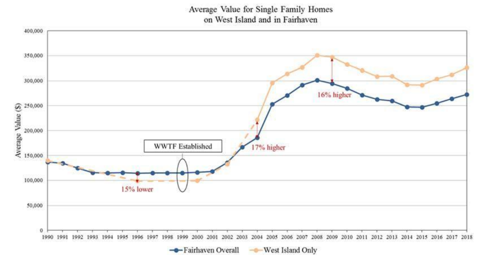

"Because the majority of these homes are used only during summer months, most are not winterized so their value tends to be lower than that of homes in the rest of Falmouth. Between 2007 and 2010, the average value for a single family home in the New Silver Beach area was 20% lower than a single family home in Falmouth. Since the wastewater treatment facility began serving homes in the New Silver Beach area in 2010, the disparity in price between single family homes in New Silver Beach and single family homes in Falmouth has narrowed. Between 2012 and 2018, the average value for a single family home in the New Silver Beach area is only 13% lower than the average value for a single family home in Falmouth" (Gurdon and Jakuba, 2018). 

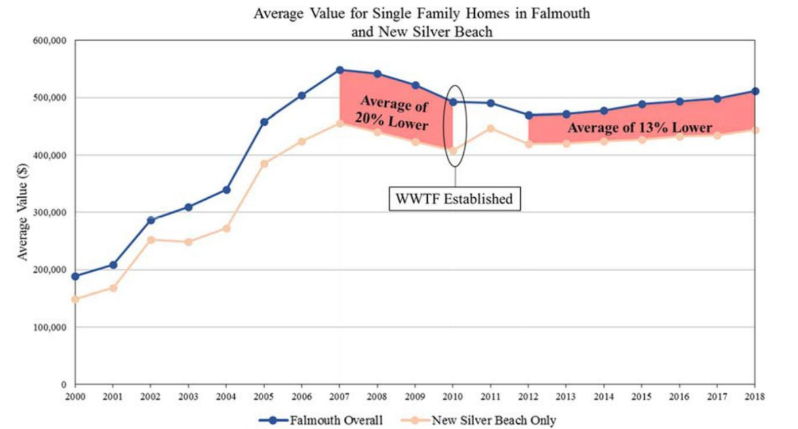

On the other hand, Netusil et al. (2014) found there is a negative impact on a property's sale price as distance from the nearest green infrastructure increases while bioswales are not significant.

## Negative impacts on property values

On the other hand, Netusil et al. (2014) mentioned, "Portland, Oregon has a long history of developing low-impact development facilities through its ‘green streets’ program and continues to promote these facilities as improving air and water quality, enhancing pedestrian and bicycle access and safety, expanding the amount of urban green space and wildlife habitat, and increasing property values (Environmental Services City of Portland, 2008). Findings from the present study provide support for some of these claims but challenge others. For example, we find a small but statistically significant increase in a property's sale price as distance from the nearest facility increases. Facility type (sidewalk bioswale, corner curb extension, curb extension, or grassy bioswale) is not found to have a statistically significant effect on a property's sale price, but a facility's size, age, design complexity, tree canopy coverage, and abundance of facilities at the census tract or census block level do have a statistically significant effect."

# Reference 

“2019 - 2024 Capital Improvement Plan Overview.” (2019). <http://www.seattle.gov/documents/Departments/FinanceDepartment/1924proposedcip/1924proposedCIPoverview.pdf> (Aug. 24, 2020).

Anderson, J. H. (2018). “Analysis and Classification of Semi-Arid Bioswales.”
“Benefits of Green Infrastructure.” (n.d.). Global Designing Cities Initiative, <https://globaldesigningcities.org/publication/global-street-design-guide/utilities-and-infrastructure/green-infrastructure-stormwater-management/benefits-green-infrastructure/> (Aug. 16, 2020).

Bousquet, C. (2017). “Where is Gentrification Happening in Your City?” Data-Smart City Solutions, <https://datasmart.ash.harvard.edu/news/article/where-is-gentrification-happening-in-your-city-1055> (Aug. 17, 2020).

Bowman, T., Tyndall, J. C., Thompson, J., Kliebenstein, J., and Colletti, J. P. (2012). “Multiple approaches to valuation of conservation design and low-impact development features in residential subdivisions.” Journal of Environmental Management, 104, 101–113.

Burden, D. (2006). “Urban street trees: 22 benefits and specific applications.” Glatting Jackson and Walkable Communities, Inc., <https://www.walkable.org/download/22_benefits.pdf> (Aug. 16, 2020).

Cohen, M., and Pettit, K. L. S. (2019). “Guide to Measuring Neighborhood Change to Understand and Prevent Displacement.” 32.

“Displacement Risk Mapping.” (2019). Puget Sound Regional Council, <https://www.psrc.org/displacement-risk-mapping> (Aug. 24, 2020).

Fontinelle, A. (2020). “What You Should Know About Home Appraisals.” Investopedia, <https://www.investopedia.com/articles/pf/12/home-appraisals.asp> (Aug. 19, 2020).

“Gentrification Mapping Methodology.” (2020). The uprooted project, <https://sites.utexas.edu/gentrificationproject/gentrification-mapping-methodology/> (Aug. 17, 2020).

Gurdon, C., and Jakuba, R. (2018). “Models of Neighborhood-Scale Wastewater Treatment on Buzzards Bay: Successes from West Island, Fairhaven and New Silver Beach, Falmouth.” <https://www.savebuzzardsbay.org/wp-content/uploads/2018/08/FINAL-NSB-and-WI-WWTF-Report-Aug2018-1.pdf> (Aug. 24, 2020).

“Herbold: Where do your property taxes go? Why are they increasing in 2018? | Westside Seattle.” (n.d.). <https://www.westsideseattle.com/robinson-papers/2018/03/02/herbold-where-do-your-property-taxes-go-why-are-they-increasing-2018> (Aug. 24, 2020).

“Indianapolis Gentrification Maps and Data.” (2015). <https://www.governing.com/gov-data/indianapolis-gentrification-maps-demographic-data.html> (Aug. 17, 2020).

Irwin, E. G. (2002). “The Effects of Open Space on Residential Property Values.” Land Economics, 78(4), 465–480.

Jaffe, E. (2020). “The challenges of mapping gentrification.” Medium, <https://medium.com/sidewalk-talk/the-challenges-of-mapping-gentrification-851c13df5b9e> (Aug. 17, 2020).

Mell, I. C., Henneberry, J., Hehl-Lange, S., and Keskin, B. (2013). “Promoting urban greening: Valuing the development of green infrastructure investments in the urban core of Manchester, UK.” Urban Forestry & Urban Greening, 12(3), 296–306.

Netusil, N. R. (2013). “Urban environmental amenities and property values: Does ownership matter?” Land Use Policy, Themed Issue 1-Guest Editor Romy GreinerThemed Issue 2- Guest Editor Davide Viaggi, 31, 371–377.

Netusil, N. R., Levin, Z., Shandas, V., and Hart, T. (2014). “Valuing green infrastructure in Portland, Oregon.” Landscape and Urban Planning, 124, 14–21.
O’Neill, P. (2013). “A new word for NYC: bioswales.” City Atlas : New York.

“Pinehurst Green Grid, Seattle.” (2017). National Association of City Transportation Officials, <https://nacto.org/case-study/pinehurst-green-grid-seattle/> (Aug. 23, 2020).

Preis, B., Janakiraman, A., Bob, A., and Steil, J. (2020). “Mapping gentrification and displacement pressure: An exploration of four distinct methodologies.” Urban Studies, 004209802090301.

“Property valuation of 1st Avenue, Seattle.” (n.d.). <http://www.city-data.com/king-county/1/1st-Avenue-15.html> (Aug. 24, 2020).

“Purple Line Corridor.” (2020). <http://knaaptime.com/plcc-dashboard/gentrification.html> (Aug. 17, 2020).

“Seattle 2035 Your City, Your Future.” (2015). <https://www.seattle.gov/dpd/cs/groups/pan/@pan/documents/web_informational/p2273984.pdf> (Aug. 19, 2020).

“Seattle is the third most gentrifying U.S. city — but that might not be as bad as you think, study finds.” (2019). The Seattle Times, <https://www.seattletimes.com/seattle-news/data/seattle-ranks-near-top-for-gentrification-but-that-might-not-be-as-bad-as-you-think-study-finds/> (Aug. 17, 2020).

“Seattle Mortgage Update 2020.” (n.d.). 13.

“Seattle on pace for second consecutive year of record-breaking venture capital investment.” (2019). <https://www.us.jll.com/en/views/snapshots/seattle-snapshot-8-7-19-jll> (Aug. 19, 2020).

Shane, M. (2016). “How Much Is My Seattle Home Worth Based On Market Value 101?” Sammamish Mortgage.

“Urban Displacement Austin Map | Urban Displacement Project.” (2020). <https://www.urbandisplacement.org/map/austin> (Aug. 17, 2020).

“Urban Displacement San Francisco Map | Urban Displacement Project.” (2020). <https://www.urbandisplacement.org/map/sf> (Aug. 17, 2020).

Ward, B., MacMullan, E., and Reich, S. (2008). “The Effect of Low-impact-development on Property Values.” Proceedings of the Water Environment Federation, 2008(6), 318–323.

“Washington Property Tax Calculator.” (2020). SmartAsset, <https://smartasset.com/taxes/washington-property-tax-calculator> (Aug. 24, 2020).

“WERF | Online Tools.” (n.d.). <https://www.werf.org/liveablecommunities/studies_sea_wa.htm> (Aug. 23, 2020).

Yonto, D., and Schuch, C. (2020). “Developing and Ground-Truthing Multi-Scalar Approaches to Mapping Gentrification.” Papers in Applied Geography, Routledge, 0(0), 1–17.
