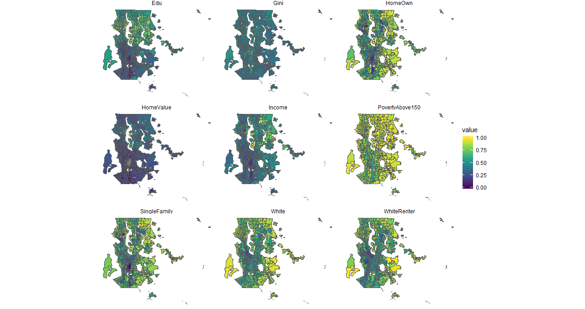
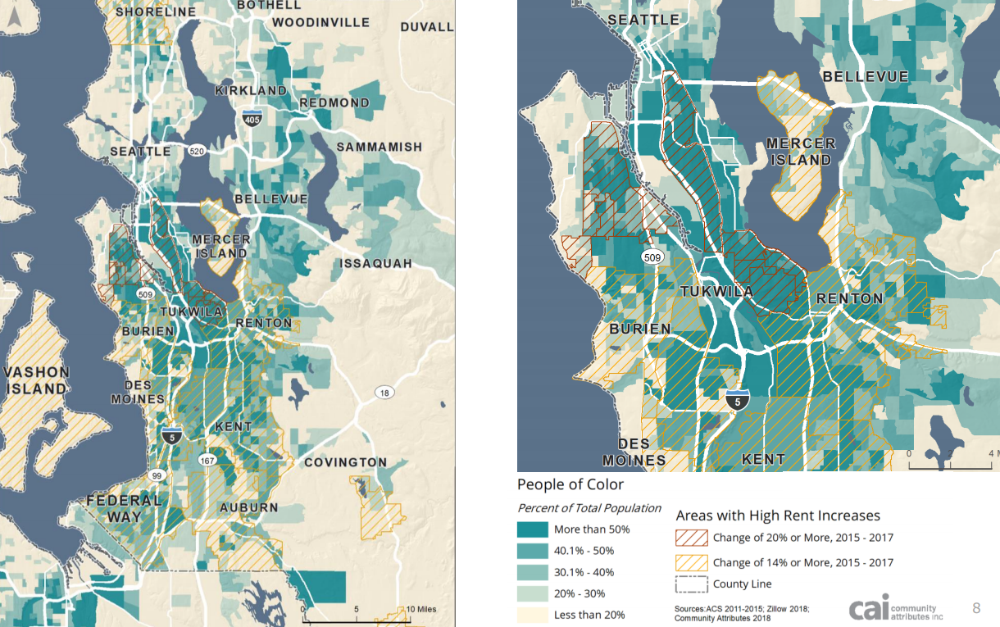
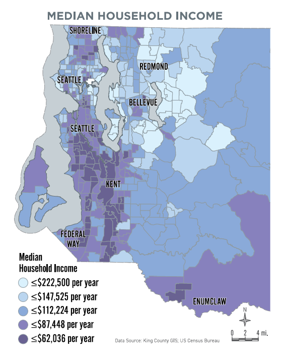
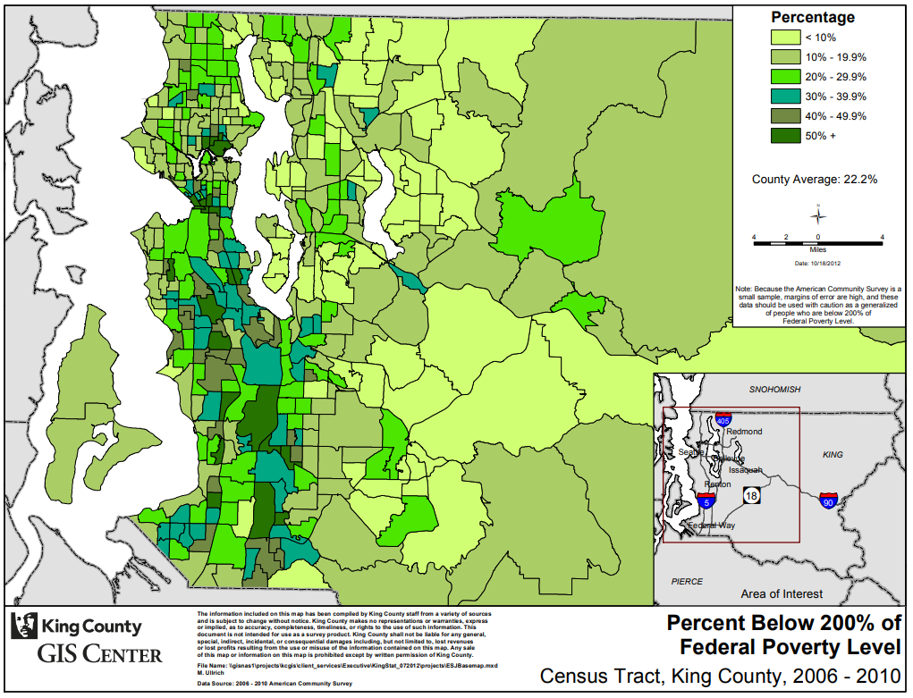
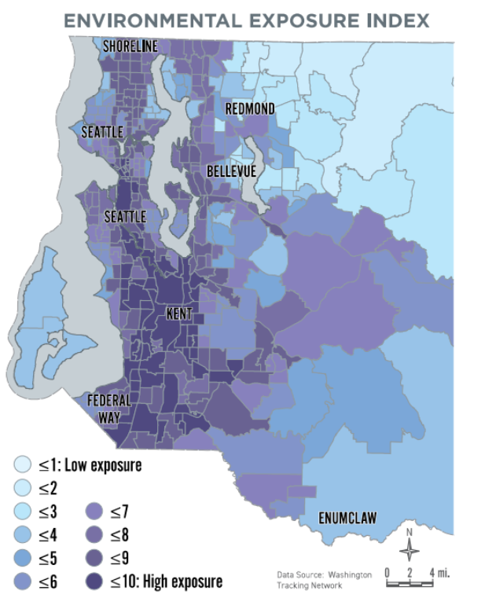
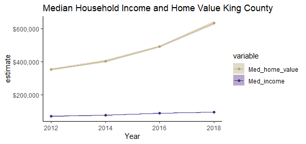
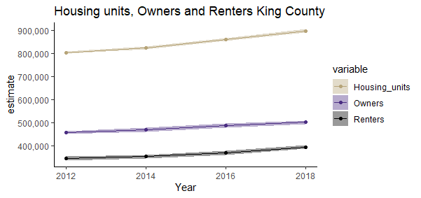
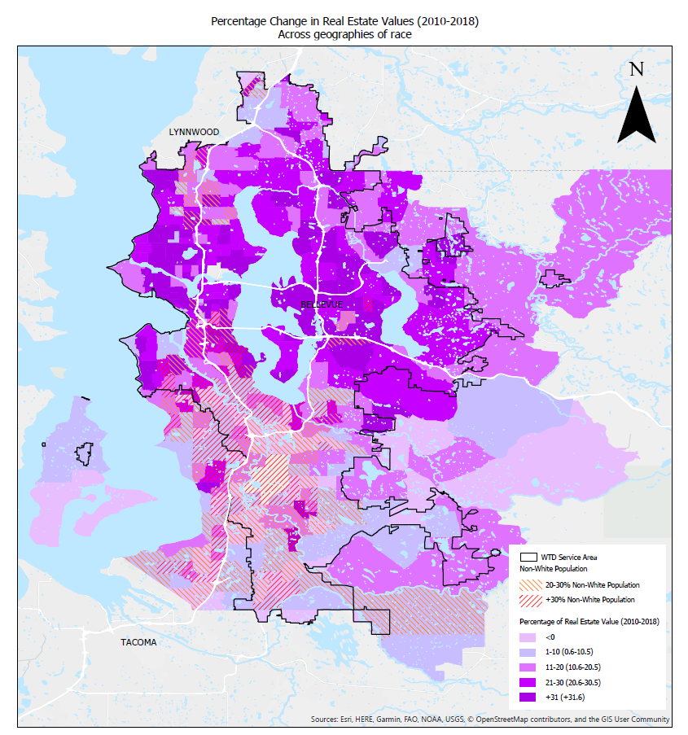

# Exploring indicators 

Various indicators were mapped with respect to displacement. Year generated and the years behind each data set will be described. People of Color (POC) is non-white population.

ACS 2014 - 2018 variables regarding proportions given census tracts are as below: 

* `Edu`: bachelor's degree or higher population over 25 years old/ total population over 25 years old
* `GINI`: household GINI Index of income inequality
* `HomeOwn`: owner-occupied housing units/ total housing units
* `HomeValue`: median value of owner-occupied housing units (standardized)
* `Income`: household median income (standardized)
* `PovertyAbove150`: population above 150 percent poverty level/ total population
* `SingleFamily`: 1-unit structured family households/ whole family households
* `White`: white population/ total population 
* `WhiteRenter`: white renter housing units/ total renter housing units

## High rent increases 

Regional Affordable Housing Task Force Meeting was held on June 1, 2018 at Seattle City Hall. The map was generated for this meeting based on data: ACS 2011 - 2015 for people of color, and Zillow 2018 for rent changes 2015 - 2017. POC in this map includes non-white races.  This map shows displacement risk areas based on the recent rent increases and the current people of color populations. 

## Income 

This map was created by King county 2020 strategic climate action plan. The data is from King county GIS, which referred to ACS. The ACS seems to be 2014 - 2018. This map includes all the races. Income is a good indicator to identify displacement risk areas. Furthermore, the poverty map and equity map are also mainly based on income, thus those sensitive areas match each other. 

## Equity score 

This interactive map is currently available in the King county GIS center. "This map viewer displays census data for language, income, poverty, race and ethnicity in King County at the census tract level. These demographic data are based on the 2010 - 2014 American Community Survey 5 Year Average provided by the Census Bureau. Since this data is based on a survey, it is considered to be an estimate and should be used with that understanding" (King county GIS center, 2020). All races are referred to for measuring equity scores. This equity map follows the similar pattern with median income map. 

## Poverty level

This may is currently available at King county executive equity and social justice last updated November 2014. The data source is from ACS 2006 - 2010 based on the 200 percent of federal poverty level - https://www.healthcare.gov/glossary/federal-poverty-level-fpl/. Specific income thresholds are determined depending upon the number in a family each year. For example, "HealthCare.gov" indicates \$12,760 for individuals \$17,240 for a family of 2 in 2019. This map includes all the races. Since this map is fundamentally based on income, this follows the similar pattern of the median income map. 

## Environmental exposure index 

This map of environmental exposure index is currently available at WA department of health based on indicators consisting of NOx, ozone, PM2.5, toxic releases, and populations near heavy traffic road ways. 2. Each indicator is updated in the recent years - NOx in Jan. 2018, and ozone and PM 2.5 in Jan. 2019. 3. The map includes all the races. 

"The Washington Environmental Health Disparities Map evaluates environmental health risk factors in communities. The model was specifically adapted from CalEnviroScreen—a cumulative environmental impacts assessment mapping tool developed by CalEPA and used in California. —It estimates a cumulative environmental health impact score for each census tract reflecting pollutant exposures and factors that affect people’s vulnerability to environmental pollution. The model is based on a conceptual formula of Risk = Threat * Vulnerability, where threat and vulnerability are based on several indicators" (WA department of health, 2020). 

## Open space opportunity areas

The map of open space opportunity areas is currently available at King county GIS center. The data is based on the periods, 2010 - 2018. The map indicate parcels that qualify as being in an open space equity Opportunity Area, based on the criteria determined by King County and the Open Space Equity Cabinet: (a) “are located in a census tract in which the median household income is in the lowest one-third for median household income for census tracts in King County; (b) “are located in a ZIP code in which hospitalization rates for asthma, diabetes, and heart disease are in the highest one-third for ZIP codes in King County; and (c) “are within the Urban Growth Boundary and do not have a publicly owned and accessible park or open space within one-quarter mile of a residence, or are outside the Urban Growth Boundary and do not have a publicly owned and accessible park or open space within two miles of a residence” (King County Code 26.12.003J). 

## Variables related to property value

Is the property values correlated with non-white population or proximity to business and jobs? Property value less increase in places where has more non-white occupied. But it could be also whether the place is located in the City or near the urban areas as those places such as Seattle and Bellevue mostly have areas with increased property value. 

The trend of household income and home value in King county shows that home value has increased more radically. And it seems units for renters mainly contribute to the increase while the whole housing units have increased. 

## Proximity to high property value (rent), high property appreciation, and jobs  

As far as the indicators for displacement are concerned, proximity to high property value or rent, high property appreciation, and jobs should be considered. This is because tracts next to higher property valued or higher property appreciation tracts tend to have demographic changes and property value increases soon or later. Thus, the first thing is to find where the tracts are located regarding higher property value or property appreciation in addition to the proximity to jobs (business, universities, etc.). So it would be necessary to map the current property value and property value changes (time series) as well as indicators of demographic changes (education, income, etc.). Furthermore, high rent changes could be an indicator complementary to the built environment characteristics (property value).

### Map improvement

The displacement risk map described above is based on high rent increases from Regional Affordable Housing Task Force Meeting. The map defines gentrification and displacement risk with high rent increases and people of color, where the high rent increases are overlapped with people of color except for the Bellevue area. And this sensitive areas are overlapped with areas sensitive to income, equity (less wealthy and more diverse), poverty, environmental exposure index and open space opportunity areas as previously shown. Thus, they could be good indicators for displacement in addition to the high rent increases. 

"CREA" recently created a map with property value changes and non-white population. Compared to the displacement risk map, this map used property value changes. CREA map shows the property value changes since 2010 while representing the current non-white population. Having property value increases since 2010 may mislead because the event of displacement may have already been done. For example, less property value increase are more obvious in places where has more non-white population occupied in the map. It may make sense to have non-white population changes during the same period of the property value increase since 2010 to see how the property value increase caused non-white population to be displaced that already happened. If it is for identifying risky area, which most likely incur displacement, non-white population with the recent (i.e., since 2018, not 2010) property value or rent increases would be appropriate indicators. 

