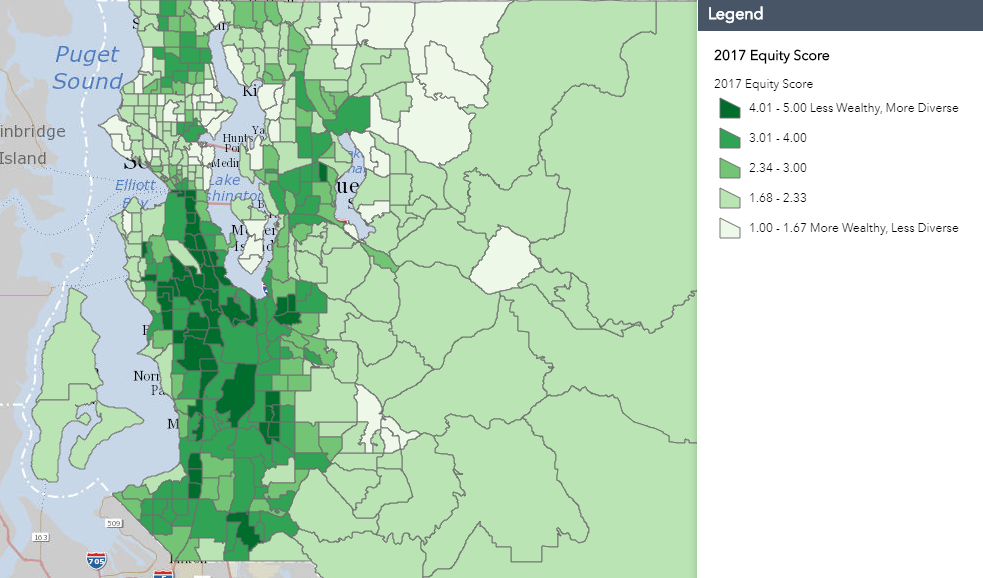
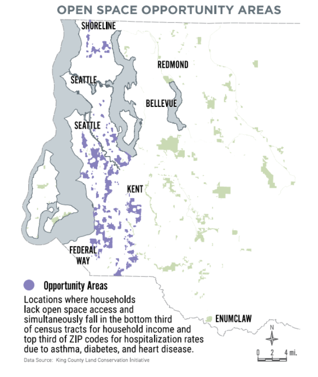

# Exploring indicators 

## High rent increases 

Regional Affordable Housing Task Force Meeting on June 1, 2018, at Seattle City Hall generated a map (hereafter, displacement risk map) based on data: ACS 2011 - 2015 for people of color, and Zillow 2018 for rent changes 2015 - 2017. POC in this map includes non-white races. This map shows displacement risk areas based on the recent rent increases and the current people of color populations - mostly geographically down to Tacoma from Seattle and Bellevue.

## High property value increases 

“CREA” created a map with variables - property value changes and non-white population. Compared to the displacement risk map from the Regional Affordable Housing Task Force Meeting, this map used property value changes. CREA map shows that the property value changes since 2010 inversely correlates to the non-white population. The graph represents the current non-white population. However, the non-white people distribution in the map is different from the one from the displacement risk map in which the non-white population also occupies most of Bellevue. Having property value increases since 2010 may mislead because the event of displacement may have already occurred. For example, less increase in property value is more evident in places with a more non-white population. It may make sense to have non-white population changes during the same period of the property value increase to see how the property value increase correlates to the non-white population change. If it is for identifying risky areas, which most likely incur displacement, non-white populations with the recent (i.e., since 2018, not 2010) property value or rent increases would be appropriate indicators.

## Education, home value, and income (ACS 2014 - 2018)

In addition to the maps described above, various indicators were presented concerning displacement risk—years when the maps were generated and years behind each data set will be described. People of Color (POC) is a non-white population.

ACS 2014 - 2018 variables regarding proportions given census tracts are as below: 

* `Edu`: bachelor's degree or higher population over 25 years old/ total population over 25 years old
* `GINI`: household GINI Index of income inequality
* `HomeOwn`: owner-occupied housing units/ total housing units
* `HomeValue`: median value of owner-occupied housing units (standardized)
* `Income`: household median income (standardized)
* `PovertyAbove150`: population above 150 percent poverty level/ total population
* `SingleFamily`: 1-unit structured family households/ whole family households
* `White`: white population/ total population 
* `WhiteRenter`: white renter housing units/ total renter housing units

Among the variables, `Edu`, `HomeOwn`, and `Income` follow a similar pattern in the displacement risk map. Thus those variables could be proxies to the displacement risk indicators. 

## Income 

The King county 2020 strategic climate action plan created the map. The data is from King county GIS, which referred to ACS. The ACS seems to be 2014 - 2018. This map includes all the races. Income is a good indicator to identify displacement risk areas. Furthermore, the poverty map and equity map are also mainly based on income; thus, those sensitive areas match each other and the displacement risk map.

## Equity score 

This interactive map is currently available in the King County GIS Center. “This map viewer displays census data for language, income, poverty, race, and ethnicity in King County at the census tract level. The Census Bureau provides these demographic data, based on the 2010 - 2014 American Community Survey 5 Year Average” (King county GIS center, 2020). This equity map follows a similar pattern with the median income map and the displacement risk map.

## Poverty level

This map is currently available at King county executive equity, and social justice last updated November 2014. The data source is from ACS 2006 - 2010 based on the 200 percent federal poverty level - https://www.healthcare.gov/glossary/federal-poverty-level-fpl/. Specific income thresholds are determined depending upon the number in a family each year. For example, “HealthCare.gov” indicated \$12,760 for individuals \$17,240 for a family of 2 in 2019. This map includes all the races. Since this map is fundamentally from income, this follows a similar pattern of the median income map and the displacement risk map.

## Environmental exposure index 

This map of the environmental exposure index is currently available at the WA department of health based on indicators consisting of NOx, ozone, PM2.5, toxic releases, and populations near heavy traffic roadways. 2. Each indicator is from recent years - NOx in Jan. 2018, and ozone and PM 2.5 in Jan. 2019. 3. The map includes all the races. This map follows a similar pattern of the displacement risk map.

“The Washington Environmental Health Disparities Map evaluates environmental health risk factors in communities. The model was specifically adapted from CalEnviroScreen—a cumulative environmental impacts assessment mapping tool developed by CalEPA and used in California. —It estimates a cumulative environmental health impact score for each census tract, reflecting pollutant exposures and factors that affect people’s vulnerability to environmental pollution. The model is based on a conceptual formula of Risk = Threat * Vulnerability, where threat and vulnerability are based on several indicators” (WA department of health, 2020).

## Open space opportunity areas

The map of open space opportunity areas is currently available at King county GIS center. The data based on the periods 2010 - 2018, indicates parcels that qualify as being in an open space equity Opportunity Area, based on the criteria determined by King County and the Open Space Equity Cabinet:

1. “Are located in a census tract where the median household income is in the lowest one-third for median household income for census tracts in King County.

2. “Are located in a ZIP code in which hospitalization rates for asthma, diabetes, and heart disease are in the highest one-third for ZIP codes in King County.

3. “Are within the Urban Growth Boundary and do not have a publicly owned and accessible park or open space within one-quarter mile of a residence, or are outside the Urban Growth Boundary and do not have a publicly owned and accessible park or open space within two miles of a residence” (King County Code 26.12.003J).

This map follows a similar pattern in the displacement risk map.

## Variables related to property value

Is the property values correlated with the non-white population or proximity to business and jobs? Property value increases less in places where it has more non-white occupied. However, whether the site is located in the City or near the urban areas could be why places such as Seattle and Bellevue mostly have areas with increased property value.

The trend of household income and home value in King County shows that home value has increased more radically. And it seems units for renters mainly contribute to the increase while the whole housing units have increased. 

## Proximity to high property value (rent), high property appreciation, and jobs  

As far as the displacement indicators are concerned, proximity to high property value or rent, high property appreciation, and jobs are important. Because tracts next to higher property valued or higher property appreciation tracts tend to have demographic changes, property value increases sooner. Thus, the first thing is to find where the tracts are regarding higher property value or property appreciation in addition to the proximity to jobs (business, universities, etc.). So it would be necessary to map the current property value and property value changes (time series) as well as indicators of demographic changes (education, income, etc.). Furthermore, high rent changes could be an indicator complementary to the built environment characteristics (property value).

### Map improvement

The displacement risk map described above features high rent increases from the Regional Affordable Housing Task Force Meeting. The map defines gentrification and displacement risk with high rent increases and people of color. The high rent increases correlate to people of color except for the Bellevue area. And these sensitive areas are overlaid with areas susceptible to income, equity (less wealthy and more diverse), poverty, environmental exposure index, and open space opportunity areas, as previously shown. Thus, they could be good indicators for displacement in addition to the high rent increases.

# References 

“Census Viewer - Equity score map.” (2014). <https://kingcounty.maps.arcgis.com/apps/webappviewer/index.html?id=70a97e804e9b4991846cda2242985272> (Sep. 10, 2020).

“Information by Location | Washington Tracking Network (WTN).” (2020). <https://fortress.wa.gov/doh/wtn/WTNIBL> (Sep. 10, 2020).

“King County climate action.” (2020). <https://kingcounty.gov/services/environment/climate.aspx> (Sep. 10, 2020).

“Maps of King County demographics - King County.” (2010). <https://www.kingcounty.gov/elected/executive/equity-social-justice/tools-resources/maps.aspx> (Sep. 10, 2020).

“Open space equity opportunity areas.” (2018). KCGIS Center, <http://www5.kingcounty.gov/sdc/Metadata.aspx?Layer=osec_parcels> (Sep. 10, 2020).

“Washington Environmental Health Disparities Map :: Washington State Department of Health.” (2020). <https://www.doh.wa.gov/DataandStatisticalReports/WashingtonTrackingNetworkWTN/InformationbyLocation/WashingtonEnvironmentalHealthDisparitiesMap> (Sep. 10, 2020).
